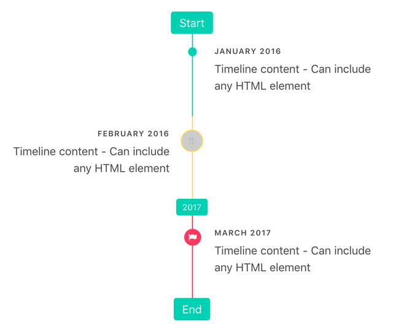

# Bulma Timeline

[](https://www.npmjs.com/package/@samlam140330/bulma-timeline)
[](https://www.npmjs.com/package/@samlam140330/bulma-timeline)

Bulma's extension to display a timeline.  
This is a fork version of the original repository [Bulma-timeline](https://github.com/Wikiki/bulma-timeline) with some additional features and bug fixes.  
Since the original repository is not maintained anymore and marked as achived, I decided to fork it and maintain it myself.

## Installation

```sh
npm install @samlam140330/bulma-timeline
```

## Usage

```scss
@use "/node_modules/@samlam140330/bulma-timeline/bulma-timeline.scss";
```

## License

[](https://www.npmjs.com/package/@samlam140330/bulma-timeline)

This project is licensed under the MIT License - see the [LICENSE.md](LICENSE) file for details.

## Acknowledgments

- [Bulma](https://github.com/jgthms/bulma)
- [Wikiki](https://github.com/Wikiki/bulma-timeline)

## Documentation & Demo

You can find the Documentation and a demo [here](https://wikiki.github.io/components/timeline/)


